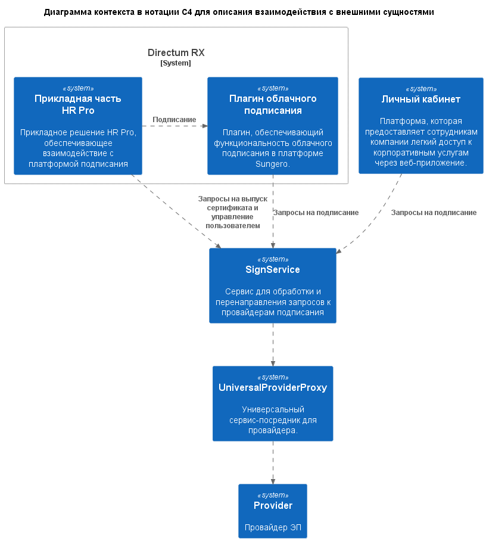
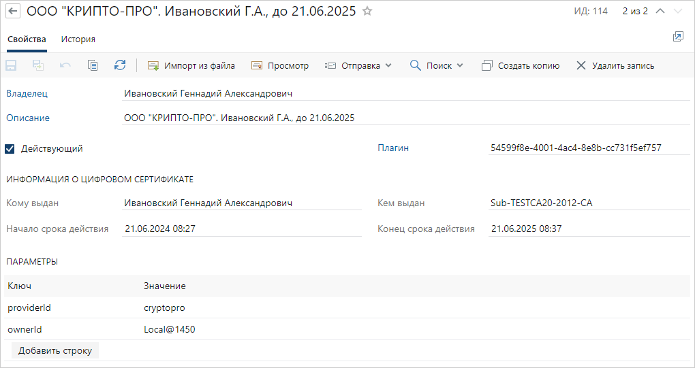

# Описание комплекта (SDK) для разработки сервиса интеграции с платформой подписания HR Pro

Используйте комплект (SDK) при разработке механизма интеграции между провайдером ЭП и платформой подписания HR Pro.

Чтобы реализовать интеграцию:

* Ознакомьтесь с [описанием архитектуры HR Pro](https://club.directum.ru/webhelp/directumrx/4.9/web/index.html?hr_pro_architecture.htm), [руководством разработчика Directum RX](https://club.directum.ru/webhelp/directumrx/4.9/web/index.html?dds_razrabotka.htm), а также [описанием прикладной конфигурации личного кабинета](https://club.directum.ru/webhelp/directumrx/4.9/web/index.html?hr_pro_lk_appsettings.htm), если планируется его использование.
* Разработайте и протестируйте [прокси-сервис](##описание-шаблона-прокси-сервиса) к провайдеру ЭП – .NET-приложение для преобразования данных, которые передаются между платформой подписания HR Pro и провайдером ЭП.
* Модифицируйте платформу подписания для взаимодействия с разработанным сервисом. Изменения необходимо внести:
  * [в прикладное решение Directum RX](##модификация-прикладной-разработки-directum-rx) **EssPlatformSolution**;
  * [в прикладную конфигурацию личного кабинета](##модификация-прикладной-конфигурации-личного-кабинета) SignPlatform.xml, если планируется его использование.

## Комплект поставки

В комплект поставки входят файлы для разработки .NET-приложения прокси-сервиса:

* Directum.SampleProviderCA:
  * Directum.TemplateProviderCA.App – шаблон сервиса;
  * Directum.TemplateProviderCA.FunctionalTests – функциональные тесты для проверки базовых кейсов использования сервиса;
* папка Postman – Postman-коллекция запросов к сервису.

## Описание шаблона прокси-сервиса

При разработке прокси-сервиса в качестве примера используйте шаблон из [комплекта поставки](##комплект-поставки). В шаблоне реализованы:

* [аутентификация запросов от сервиса подписания](###аутентификация-запросов-от-сервиса-подписания) с помощью JWT-токенов;
* [контроллеры API для преобразования запросов](###контроллеры-api-для-преобразования-запросов) от сервиса подписания к провайдеру ЭП;
* [методы проверки состояния сервиса](###методы-проверки-состояния-сервиса).

Для проверки работы сервиса используйте [Postman-коллекцию](###коллекция-postman) и [функциональные тесты](###функциональные-тесты) из комплекта поставки.

При необходимости используйте Swagger для разработки документации в формате OpenAPI и генерации запросов к сервису с JWT-токенами.

Диаграмма контекста (С4) для прокси-сервиса (**UniversalProviderProxy**) выглядит так:

### Аутентификация запросов от сервиса подписания

Для аутентификации запросов сервис подписания передает прокси-сервису JWT-токены, выпускаемые сервисом идентификации. В шаблоне сервиса реализована обработка таких токенов.

Настройки аутентификации задаются в конфигурационном файле прокси-сервиса appsettings.json в секции **Authentication**:

* **Audience** – аудиенция токена. Назначается прокси-сервисом, далее значение необходимо передать сервису подписания;
* **TrustedIssuers** – доверенные издатели токенов. Для каждого издателя указывается имя в параметре **Issuer** и задается один из способов валидации токенов:
  * **EncryptionKey** – с помощью симметричного ключа шифрования. Способ используется при разработке и отладке сервиса;
  * **SigningCertificatePath** – с помощью JWT-сертификата. В параметре указывается путь к файлу сертификата;
  * **SigningCertificateThumbprint** - с помощью JWT-сертификата. В параметре указывается отпечаток сертификата, установленный на сервере, где разворачивается сервис.

ВАЖНО. Параметры издателей токенов должны совпадать с теми, что указаны в настройках сервиса идентификации личного кабинета. Подробнее см. в руководстве администратора HR Pro, раздел «Сервис идентификации» ([Linux](https://club.directum.ru/webhelp/directumrx/4.9/web/index.html?hr_admin_linux_servis_identifikatsii_lk_nastroiki.htm), [Windows](https://club.directum.ru/webhelp/directumrx/4.9/web/index.html?hr_admin_servisidentifikatsii_lk_nastroiki.htm)).

### Контроллеры API для преобразования запросов

В шаблон включен пакет NuGet с моделями API.

ВАЖНО. В процессе разработки актуальная версия сервиса подписания может измениться. Чтобы обеспечить корректную работу API, версия пакета должна соответствовать версии сервиса.

Шаблон содержит контроллеры API:

* **SignController** – для подписания документов;
* **CertificateIssuesController** – для выпуска сертификата;
* **CertificateController** – для управления сертификатами;
* **SigningConfirmationOptionsController** – для управления способами подтверждения подписания.

Методы контроллера **SignController** обязательны для реализации.

Методы остальных контроллеров необходимы, только если провайдер ЭП предоставляет возможность управления облачными сертификатами и способами подтверждения подписания. Если процессы, соответствующие этим методам, не поддерживаются провайдером, то методы должны возвращать HTTP-статус **405** (method not allowed).

### Методы проверки состояния сервиса

В шаблоне реализованы методы:

* **/version** – возвращает версию сервиса;
* **/health** – возвращает состояние сервиса. В шаблоне реализована базовая проверка работоспособности сервиса. При необходимости можно добавить проверки работоспособности БД и внешних сервисов. Обязателен для реализации;
* **/checktrust** – проверяет доверие к сервису. Обязателен для реализации.

### Коллекция Postman

Коллекция содержит примеры запросов от сервиса подписания, их описание и особенности. Они распределены по папкам, каждая из которых соответствует процессу с участием сервиса подписания.

Для работы с коллекцией используется HTTP-приложение Postman. Через него можно отправлять запросы прокси-сервису, чтобы проверить их обработку. Это позволяет ускорить и упростить разработку сервиса.

Подробнее о приложении см. на официальном сайте [www.postman.com](https://www.postman.com).

Перед отправкой запросов проверьте переменные коллекции, для которых указаны значения по умолчанию. Например адреса сервисов, к которым отправляются запросы. Такие значения необходимо заменить на свои.

ВАЖНО. Переменные, для которых не заданы значения, используются для хранения и передачи информации между запросами. Задавать их значение вручную не нужно. Чтобы при выполнении запросов такие переменные заполнялись корректно, запросы необходимо отправлять последовательно для каждого процесса в том порядке, в котором они расположены в коллекции.

### Функциональные тесты

Функциональные тесты проверяют процесс выпуска сертификата и ожидаемый формат ошибок в негативных кейсах. Тесты используют те же Refit-клиенты, что и сервис подписания при вызове прокси-сервиса. Эти клиенты включены в пакет NuGet.

ВАЖНО. Тесты имитируют взаимодействие с другими сервисами для проверки работы API. Использовать их для тестирования реальных кейсов нельзя.

Тесты можно запустить:

* через тестовый хост проекта Directum.TemplateProviderCA.App. На нем также поддерживается отладка проекта;
* через тестовый или продуктивный хост, на котором развернут провайдер ЭП. Для этого нужно в методе **SetUp** раскомментировать строку **RealHost()**.

#### Использование JWT-токенов

Для [аутентификации запросов от сервиса подписания](###аутентификация-запросов-от-сервиса-подписания) в исходном коде тестов указан JWT-токен **ServiceToken**. Он используется для подписания документов, в том числе с помощью QR-кода. Параметры токена:

* срок действия – **10** лет;
* ключ шифрования, которым подписан токен – **ZNBSyxgFERlvXt6JbO5ujWkMAPy1d00M**;
* содержание:
`{ "nbf": 1717423797, "exp": 2017424697, "iss": "HrProId", "aud": "SampleProviderCA" }`

Эти значения соответствуют параметрам, указанным в конфигурационных файлах шаблона сервиса:
* appsettings.json:
`"Authentication": {` \n `    "TrustedIssuers": { `
`        "Issuer": "HrProId"`
`         ...`
`    }`
` }`
* appsettings.Development.json:
`"Authentication": {`
`    "TrustedIssuers": {`
`        "EncryptionKey": "ZNBSyxgFERlvXt6JbO5ujWkMAPy1d00M"`
`        ...`
`    }`
`    "Audience": "SampleProviderCA"`
`}`

При изменении параметров в конфигурационных файлах необходимо в тестах задать соответствующие значения или реализовать выпуск нужного токена динамически.

## Модификация прикладной разработки Directum RX

Для работы с сертификатами ЭП необходимо реализовать создание сущностей ICertificate (цифровые сертификаты) при выпуске сертификатов провайдером ЭП, а также заполнение обязательных свойств этих сущностей. При этом:

* в свойстве **PluginId** (**Плагин**) должно указываться значение **54599f8e-4001-4ac4-8e8b-cc731f5ef757**. Это ИД плагина Directum RX, который используется для работы с облачными сертификатами;
* в свойстве **Parameters** (**Параметры**) должны передаваться пары «ключ-значение»:
  * ключ **ProviderId**, значение возвращается в ответ на запрос /v3/CloudSignProviders к сервису подписания;
  * ключ **OwnerId**, значение формируется по шаблону **<ИД тенанта>@<ИД персоны>**. В прикладной разработке системы HR Pro его можно получить с помощью функции **GetUidPerson()**.

Остальные свойства см. в описании объектной модели Directum RX, раздел [«Certificates – цифровые сертификаты»](https://club.directum.ru/webhelp/directumrx/4.9/web/index.html?om_certificates.htm).

Пример сущности ICertificate – записи справочника **Цифровые сертификаты**:

В стандартной поставке решения **EssPlatformSolution** добавление записи в справочник реализовано в модуле **SignPlatform** через задачу на выпуск сертификата (CertificateIssueTask). В ней можно посмотреть реализацию работы с сертификатами от провайдеров ЭП, которые поддерживаются в стандартной поставке системы HR Pro. Рекомендуется выполнять модификацию на основе этой задачи.

## Модификация прикладной конфигурации личного кабинета

Если при [модификации прикладной разработки](##модификация-прикладной-разработки-directum-rx) в Directum RX были созданы новые типы заданий или уведомлений для пользователя, в прикладную конфигурацию личного кабинета SignPlatform.xml добавьте [карточки объектов](https://club.directum.ru/webhelp/directumrx/4.9/web/index.html?hr_lk_objectcard.htm) для них.

При необходимости внесите в конфигурацию дополнительные изменения. Подробнее см. в описании прикладной конфигурации личного кабинета раздел [«solution – конфигурация решения»](https://club.directum.ru/webhelp/directumrx/4.9/web/index.html?hr_lk_solution.htm).

